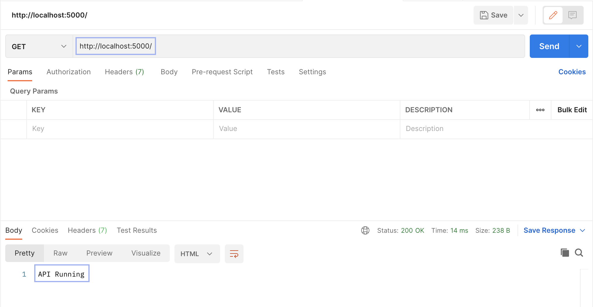

&nbsp;

Once you have successfully installed Node.js and MongoDB latest versions on your system and init the package.json, you are ready to start your **Node (Express) Server** server with the MongoDB database and print the connection from the console.

In this tutorial, we are going to create a simple backend server, establish routes and the connection to the Mongo Atlas database.

## # STEP 1 - Required dependencies

The first step is to install the dependencies necessaries for starting up the Express Server

We use:

* express: Node framework used for build web browser applications.</br>
	`npm install express`
* dotenv: Loads environment variables from the .env file.</br>
	`npm install dotenv `
* mongoose: Create object model</br>
	`npm install mongoose`

Now we can start building our HTTP server.

## # STEP 2 - Setup Express Server

To start the **Node (Express) Server** create a server.js file in a folder called “config” and require the Express dependency:

```
const express = require(‘express’)
const app = express()
```

After that, we init the middleware that parses the headers when the Content-Type is a JSON type request:

```
app.use(express.json({ extended: false }))
```

Now choose the port where the Express server is going to stabish the HTTP connection.
The port is a private address, don’t commit it to a remote repository; we need to separate it from the API files, creating a .env file in the root folder and writing the port, without spaces:

`PORT=5000`

Back in our server.js file, store the port number in a variable, using “process.env.PORT” from “dotenv” dependency, which loads the environment variables, or use a port by default. Finish by connecting the HTTP server and printing out the result:

```
const PORT = process.env.PORT || 5000

app.listen(PORT, () => {
  console.log(`Server connected on port ${PORT}`)
})
```

Now if we run `node config/server.js` (or use nodemon to automatically server reloads) the message “Server connected on port 5000” should appear on the console.

To test the server, in server.js file before the port connection, create the petition to / route (localhost:5000):

```
app.get(‘/‘,  (req, res) => 
	res.send(‘API Running’)
)
```

And test the GET request in [Postman](https://www.postman.com/) software:



The **simple express server** is successfully connected and running.

## # STEP 3 - Setup MongoDB Database

Go to the [Mongo Atlas](https://www.mongodb.com/cloud/atlas) website to **connect the mongo client**  and create a new account.
Now create a new project, I called it “node_server”; click “next” and if you want to create add members, you can invite them via email,  if not, leave blank and click “Create Project”.

Build a Database, select the shared database if you want the Free plan.
If you want, change the settings options and the name for your database server, otherwise, leave it as it is and Create the cluster.</br>
Create an admin user and select a strong password, don’t forget it, we will need it later.
In this cluster, we will store all the fields such as “name”, “email”, etc...

Wait 1-3 minutes and the cluster will be created, click the “Connect” option and select “Connect your application”.:


Copy the “mongodb+srv://“ code and paste it into the .env file that we have created before.

The .env file should look like this:


Replace <password> with the password that you have created before, and myFirstDatabase with the name of your project, in my case “node_server”.

To create the connection between the server and the database we need to create a new file “db.js” into the “config” folder.

We require the mongoose package that allows **MongoDB to connect to the database** and create models (objects) such as employees or clients profiles.</br>
As we did in the server.js file, we store the mongo connection address in a variable:

```
const mongoose = require(‘mongoose’)
require(‘dotenv’).config() // Don't forget to require the dotenv module to read the environment variables

const mongoURI = process.env.MONGOURI
```

Now create a function called “connectionDB” so we can export the Mongo connection and import it later in the main server config file.

We use try and catch statement to handle all possible connection errors.</br>
`mongoose.connection.on` will print the output message “Database connected” when the connection is successfull. </br>
`mongoose.connect` receive the database address (mongoURI ) and connection properties.
When an error occurs, the connection will exit and print an error message:

```
const connectionDB = async () => {
 try {
  mongoose.connection.on(‘open’, () => {
    console.log(‘Database connected on:’, mongoose.connection.name)
  })
  await mongoose.connect(mongoURI, {
    useNewUrlParser: true,
    useUnifiedTopology: true,
    useCreateIndex: true
  })
 } catch(err) {
  console.error(err.message)
  process.exit(1)
 }
}
```

Export the function:

```
module.exports = connectionDB
```

To finish the Mongo setup, go to the “server.js” file and import the connection to **start the node server**:

```
const connectionDB = require(‘./db’)

connectionDB() // Call the function and connect database
```

Save the server.js file and run it in the terminal.</br>
The output should be:</br>
`Server connected on port 5000`</br>
`Database connected on: node_server`

&nbsp;

## # STEP 4 - Create Express Routes

In the last step, we are going to create routes to serve all HTTP requests.

Request methods:

* **GET**: Obtain data from the HTTP request or database information. 
* **POST**: Send information to be processed and update or create data in the server.
* **PUT**: Update a resource in the database.
* **DELETE**: Remove data from the database.
	
Create a new folder called “routes” in the root directory. </br>
Inside, create a file called “index.js”.

Import the Express package and create a new Router that will handle all routes:

```
var express = require('express');
var router = express.Router();
```

A middleware is an event handler that is activated under certain petitions or all of them.</br>
We can create as many middlewares as we want.

Use the .get method to create a middleware that will receive requests at the / page (http://localhost5000/):

```
/* GET home page. */
router.get('/', function(req, res, next) {
  res.json({ msg: 'API Homepage' })
});
```

The { next } parameter will pass the control of the actual middleware to the specified handler, which is optional.

Export the Router:

```
module.exports = router
```

In the config/server.js file, remove the line code `app.get(‘/‘, (req, res) => res.send(‘API Running’))` that we have created before and import the routes.</br>
Use the .use method to connect the route (/) and the imported router:

```
app.use(‘/‘, require(‘../routes/index’))
```

Now run a GET request in Postman to the homepage: http://localhost:5000/ and the output should be:

```
{
    “msg”: “API Homepage”
}
```

You can create different routes and request methods to navigate between your server routes and add new information to the database doing a POST request to localhost:5000/create-user route and create data models with Mongoose.

# Final Thoughts

From this point, you can scale your server and build the Front-End folders and connect it to your Back End server using concurrently dependency with one simple run command.

In which way are you going to continue this server?